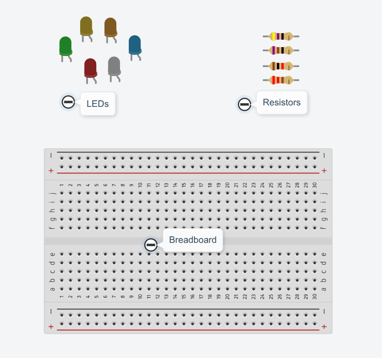
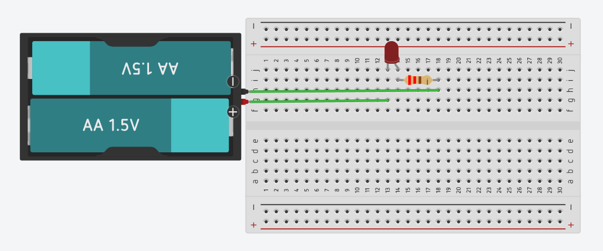

# Getting started with Arduino

An Arduino is essentially a tiny computer that can **control electricity**.

That means we can write code to turn things on and off, read signals from sensors, and control all sorts of electronic components. With an Arduino, you can control LEDs, buzzers, motors, displays, and much more.

Here are some components you might see frequently


But before we start working with the arduino, we need to learn: **how do we actually connect all these electronic components together?**

## Working With Electronic Components

That 'white thing' with a bunch of holes is called a **solderless breadboard**. It gives us an easy way to connect electronic components together without having to solder wires or components together.

You simply push the component leads and jumper wires into the holes, and the breadboard takes care of electrically connecting the components.

The important thing to remember is that **not every hole is connected to every other hole**. The holes are connected in groups.

On a typical breadboard, the holes in the middle are connected in small rows like this:

```txt
  a b c d e     f g h i j

  ● ● ● ● ●     ● ● ● ● ●
  │ │ │ │ │     │ │ │ │ │
  └─┴─┴─┴─┘     └─┴─┴─┴─┘
```

This means that the holes **a, b, c, d, and e** in the same row are electrically connected. The same is true for **f, g, h, i, and j**.

However, there is a gap down the middle of the breadboard. The five holes on the *abcde* side are **not** connected to the five holes on the *fghij* side.

There are also long rows of holes along the edges of most breadboards. These are usually used to distribute **power and ground** around the circuit. Every hole along the line horizontally is connected (refer to the image).

Once you understand which holes are connected, a breadboard becomes much less mysterious. It's really just a convenient way of making electrical connections by plugging things in.

We can connect these components to make a simple *circuit*. Here's what it looks like.



In our circuit, the **battery provides the electrical energy**, the **LED converts some of that energy into light**, and the **resistor limits the current flowing through the LED**. The resistor literally prevents the LED from blowing up!

## Installing the Arduino IDE

Now let's see what the Arduino can do. Instead of having the LED connected directly to a battery, we can have the **Arduino control when the LED turns on and off**. We get to decide exactly when this happens using code. This is what we'll be learning throughout this guide: **how to use code to control electricity and build things with it.**


The first step is getting the software we'll use to program our Arduino. We'll use the **Arduino IDE**. It's the program where we write our Arduino code and upload it to the arduino. You can download it from the [official Arduino website](https://www.arduino.cc/en/software/).
